## Activité Pratique N°3 - Event Driven Architecture 📖🎓
La conception et la mise en œuvre d'une application Java reposant sur les principes du modèle CQRS (Command Query Responsibility Segregation) et de l'Event Sourcing, avec l'utilisation des frameworks Axon et Spring Boot.

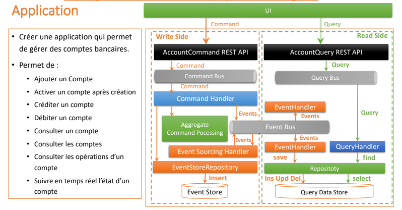

### Objectifs de l'activité
L'objectif principal de cette activité est de familiariser avec les concepts de CQRS et Event Sourcing, ainsi qu'avec les outils puissants que sont Axon Framework et Spring Boot. À la fin de cette activité, on va développer une compréhension pratique de la manière dont ces modèles architecturaux peuvent être appliqués pour construire des systèmes robustes et évolutifs.

### Réalisation de l'activité
#### 1. Création du projet
Pour créer le projet, on va utiliser l'outil Spring Initializr. On va créer un projet Maven avec les dépendances suivantes :
- Spring Web
- Spring Data JPA
- Axon Framework
- Lombok
- Spring Boot DevTools
- Open API

#### 2. Architecture de l'application

#### 3. Commands and Events
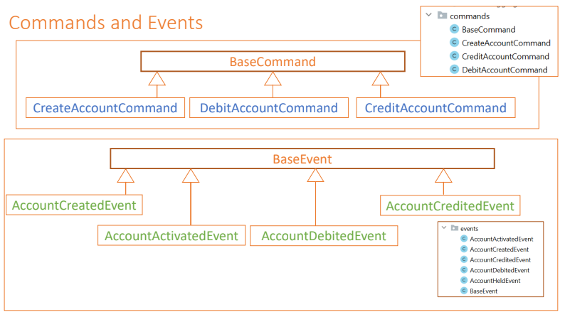
##### Implémentation des commandes
###### **CommonApi**
CommonApi contient les classes de base pour les commandes et les événements. Il contient également les annotations nécessaires pour identifier les agrégats et les événements.
### 1) Commands Side
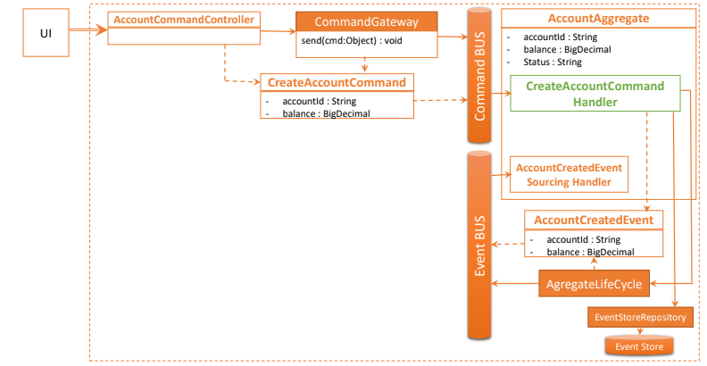
* BaseCommand
Cette classe est la classe de base pour toutes les commandes. Elle contient l'identifiant de l'agrégat cible.
```java
public abstract class BaseCommand<T> {
    @TargetAggregateIdentifier
    @Getter
    private T id;

    public BaseCommand(T id) {
        this.id = id;
    }
}
```
***@TargetAggregateIdentifier*** est une annotation qui identifie l'agrégat cible d'une commande. Elle est utilisée pour déterminer l'instance de l'agrégat à laquelle la commande doit être envoyée.
Remarque: Les commandes sont des objets immuables. Cela signifie que les champs de la commande ne peuvent pas être modifiés après sa création. C'est pourquoi nous utilisons Lombok pour générer automatiquement les constructeurs et les getters.

* CreateAccountCommand
```java
public class CreateAccountCommand extends BaseCommand<String> {
    @Getter
    private String currency;
    @Getter
    private double initialBalance;

    public CreateAccountCommand(String id, String currency, double initialBalance) {
        super(id);
        this.currency = currency;
        this.initialBalance = initialBalance;
    }
}
```
* CreditAccountCommand
```java
public class CreditAccountCommand extends BaseCommand<String> {
    private double amount;
    private String currency;

    public CreditAccountCommand(String id, double amount, String currency) {
        super(id);
        this.amount = amount;
        this.currency = currency;

    }
}
```
* DebitAccountCommand
```java
public class DebitAccountCommand extends BaseCommand<String> {
    private double amount;
    private String currency;

    public DebitAccountCommand(String id, double amount, String currency) {
        super(id);
        this.amount = amount;
        this.currency = currency;

    }
}
```
* AccountCommandController
Ce contrôleur est responsable de la réception des commandes et de leur envoi au bus de commande. 

```java
@RestController
@RequestMapping("/commands/account")
public class AccountCommandController {

    private CommandGateway commandGateway;

    public AccountCommandController(CommandGateway commandGateway) {
        this.commandGateway = commandGateway;
    }

    @PostMapping("/create")
    public CompletableFuture<String> createNewAccount(@RequestBody CreateAccountRequestDto request) {
        return commandGateway.send(new CreateAccountCommand(
                UUID.randomUUID().toString(),
                request.getCurrency(),
                request.getInitialBalance()
        ));
    }

    @ExceptionHandler(Exception.class)
    public ResponseEntity<String> exceptionHandler(Exception exception) {
        return new ResponseEntity<>(exception.getMessage(), HttpStatus.INTERNAL_SERVER_ERROR);
    }
}
```
#### Handlers
```java
@ExceptionHandler(Exception.class)
    public ResponseEntity<String> exceptionHandler(Exception exception) {
        return new ResponseEntity<>(exception.getMessage(), HttpStatus.INTERNAL_SERVER_ERROR);
    }
```
#### Aggregate
Cette classe est responsable de la gestion des commandes et de la publication des événements. Elle est annotée avec @Aggregate.
```java
@Aggregate
public class AccountAggregate {
    @AggregateIdentifier
    private String accountId;
    private double balance;
    private String currency;

    private AccountStatus status;

    public AccountAggregate() {
        // Required by Axon to build a default Aggregate prior to Event Sourcing
    }
    
    @CommandHandler
    public AccountAggregate(CreateAccountCommand command) {
        if(command.getInitialBalance() < 0) throw new NegativeBalanceException("Initial balance cannot be negative");
        AggregateLifecycle.apply(new AccountCreatedEvent(
                command.getId(),
                command.getCurrency(),
                command.getInitialBalance(),
                AccountStatus.CREATED
        ));
    }

    @EventSourcingHandler
    public void on(AccountCreatedEvent event) {
        this.accountId = event.getId();
        this.balance = event.getBalance();
        this.currency = event.getCurrency();
        this.status = event.getStatus();
    }


}
```

* **CommandHandler** est une annotation qui indique à Axon que cette méthode doit être invoquée lorsqu'une commande est reçue. Cette méthode est responsable de la validation des commandes et de la publication des événements == Fonction de décision.
* **EventSourcingHandler** est une annotation qui indique à Axon que cette méthode doit être invoquée lorsqu'un événement est reçu. Cette méthode est responsable de la mise à jour de l'état de l'agrégat == Fonction d'évolution.

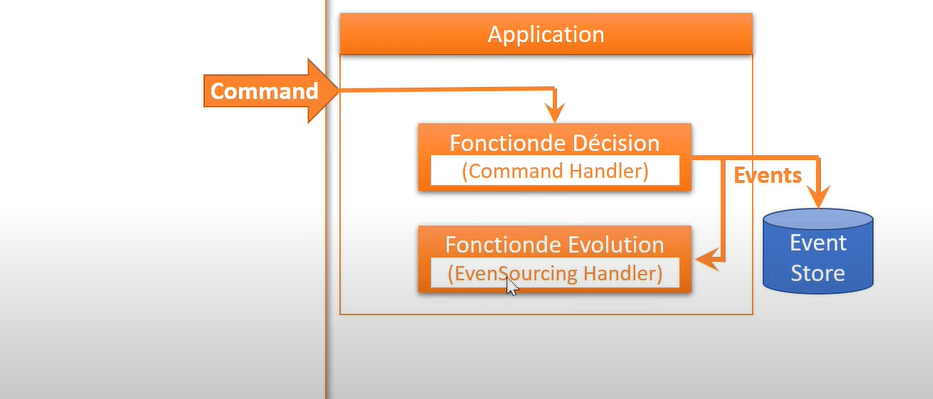

#### Création des événements
* BaseEvent
```java
public class BaseEvent<T> {
    @Getter
    private T id;

    public BaseEvent(T id) {
        this.id = id;
    }
}
```
* AccountCreatedEvent
```java
public class AccountCreatedEvent extends BaseEvent<String> {
    @Getter
    public String currency;
    @Getter
    public double balance;
    @Getter
    private AccountStatus status;

    public AccountCreatedEvent(String id, String currency, double balance, AccountStatus status) {
        super(id);
        this.currency = currency;
        this.balance = balance;
        this.status = status;
    }
}
```
**AggregateLifecycle.apply()** est une méthode qui publie un événement sur le bus d'événements. Cet événement sera ensuite envoyé à tous les gestionnaires d'événements qui l'écoutent et transférer les données de la commande vers l'événement.
* AccountActivatedEvent
```java
public class AccountActivatedEvent extends BaseEvent<String> {
    @Getter
    public AccountStatus status;

    public AccountActivatedEvent(String id, AccountStatus status) {
        super(id);
        this.status = status;
    }
}
```
#### Création des commandes
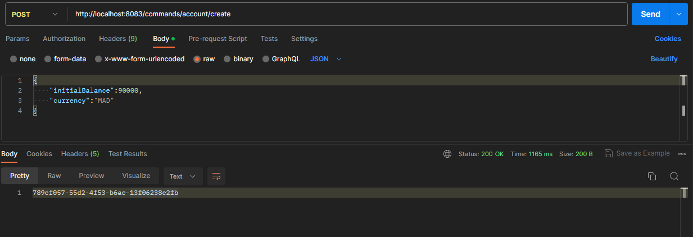

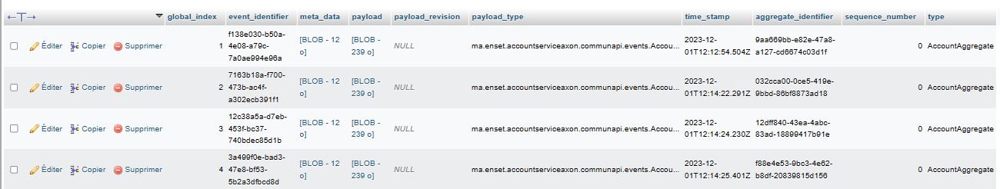

EventStore est une base de données qui stocke tous les événements qui ont été publiés par les agrégats. 

* Consultation de EventStore
```java
    @GetMapping("/eventStore/{accountId}")
    public Stream eventStore(@PathVariable String accountId) {
        return eventStore.readEvents(accountId).asStream();
    }
```
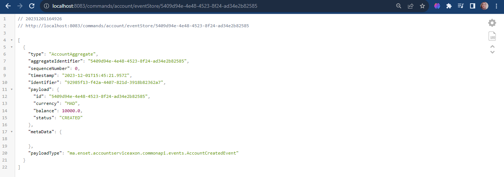

* AccountCreditedEvent
```java
public class AccountCreditedEvent extends BaseEvent<String> {
    @Getter
    public String currency;
    @Getter
    public double amount;


    public AccountCreditedEvent(String id, String currency, double amount) {
        super(id);
        this.currency = currency;
        this.amount = amount;
    }
}
```

Dans le contrôleur, on va créer une méthode pour créditer un compte.
```java
@PutMapping("/credit") 
public CompletableFuture<String> creditAccount(@RequestBody CreditAccountRequestDto request) {
    return commandGateway.send(new CreditAccountCommand(
    request.getAccountId(),
    request.getAmount(),
    request.getCurrency()
    ));
}
```
Dans l'agrégat, on va créer une méthode pour gérer la commande CreditAccountCommand.
```java
    @CommandHandler
    public void handle(CreditAccountCommand command) {
        if (command.getAmount() < 0) throw new AmountNegativeException("Cannot credit a negative amount");
        AggregateLifecycle.apply(new AccountCreditedEvent(
                command.getId(),
                command.getCurrency(),
                command.getAmount()
        ));
    }
```
On va créer une méthode pour gérer l'événement AccountCreditedEvent et pour muter l'état de l'application.
```java
    @EventSourcingHandler
    public void on(AccountCreditedEvent event) {
        this.balance += event.getAmount();
    }
```
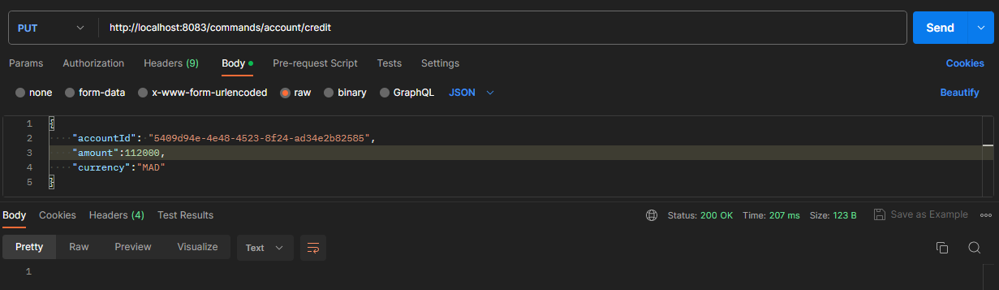
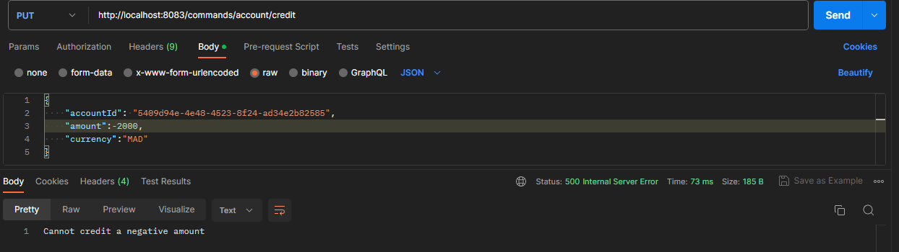
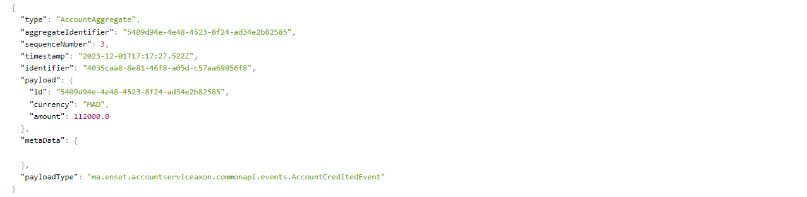

* DebitAccountCommand
```java
public class DebitAccountCommand extends BaseCommand<String> {
    @Getter private double amount;
    @Getter private String currency;

    public DebitAccountCommand(String id, double amount, String currency) {
        super(id);
        this.amount = amount;
        this.currency = currency;

    }
}    
```

* AccountDebitedEvent
Dans le contrôleur, on va créer une méthode pour débiter un compte.
```java
 @PutMapping("/debit")
    public CompletableFuture<String> debitAccount(@RequestBody DebitAccountRequestDto request) {
        return commandGateway.send(new DebitAccountCommand(
                request.getAccountId(),
                request.getAmount(),
                request.getCurrency()
        ));
    }
```
Dans l'agrégat, on va créer une méthode pour gérer la commande DebitAccountCommand.

```java
    @CommandHandler
    public void handle(DebitAccountCommand command) {
        if (command.getAmount() < 0) throw new AmountNegativeException("Cannot debit a negative amount");
        if (this.balance - command.getAmount() < 0) throw new InsufficientBalanceException("Insufficient balance");
        AggregateLifecycle.apply(new AccountDebitedEvent(
                command.getId(),
                command.getCurrency(),
                command.getAmount()
        ));
    }
```

On va créer une méthode pour gérer l'événement AccountDebitedEvent et pour muter l'état de l'application.

```java
    @EventSourcingHandler
    public void on(AccountDebitedEvent event) {
        this.balance -= event.getAmount();
    }
```
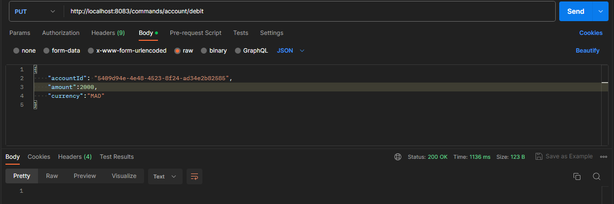
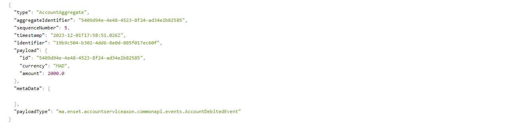
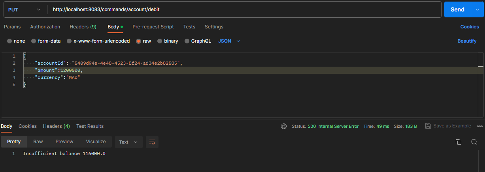
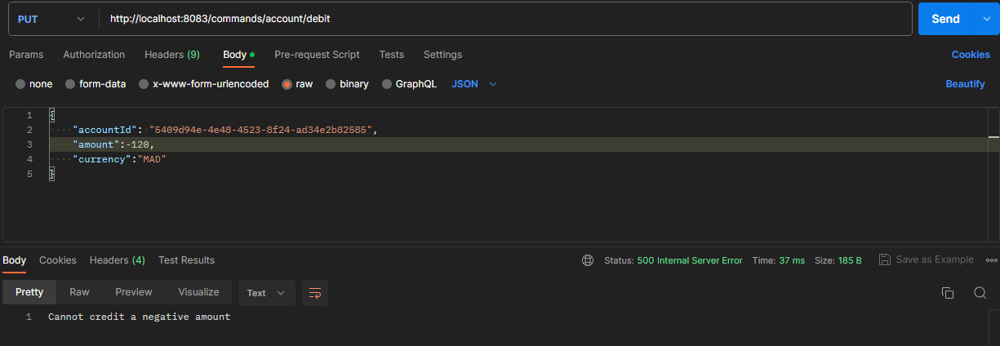
### 2) Query Side
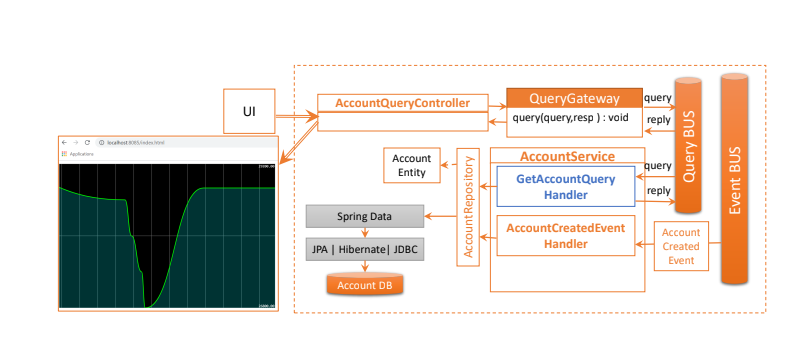
#### JPA entities
* Account Entity
```java
@Entity
@Data
@NoArgsConstructor
@AllArgsConstructor
public class Account {
    @Id
    private String id;
    private double balance;
    private String currency;
    @Enumerated(EnumType.STRING)
    private AccountStatus status;
    @OneToMany(mappedBy = "account")
    private Collection<Operation> operations;
}
```
* Operation Entity
```java
public class Operation {
    @Id
    @GeneratedValue(strategy = GenerationType.IDENTITY)
    private Long id;
    private Date date;
    private double amount;
    @Enumerated(EnumType.STRING)
    private OperationType operationType;
    @ManyToOne
    private Account account;

}
```
#### JPA repositories
* AccountRepository
```java
public interface AccountRepository extends JpaRepository<Account, String> {
}
```
* OperationRepository
```java
public interface OperationRepository extends JpaRepository<Operation, Long> {
}
```

