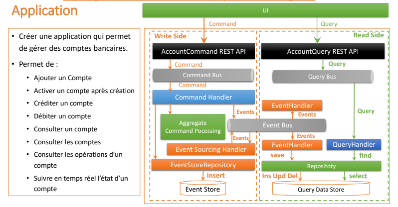
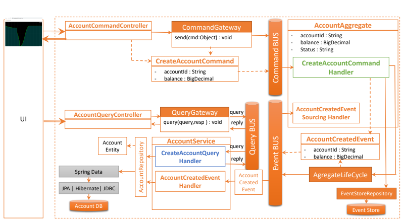
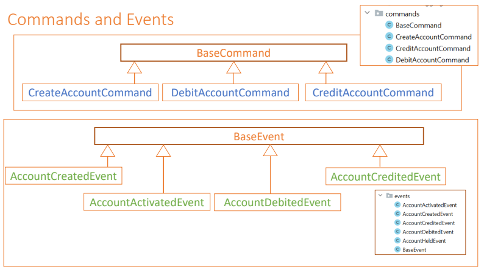
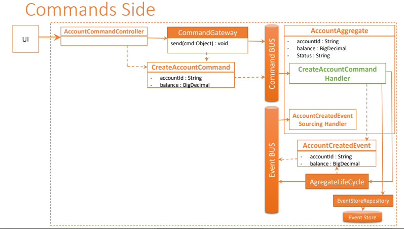
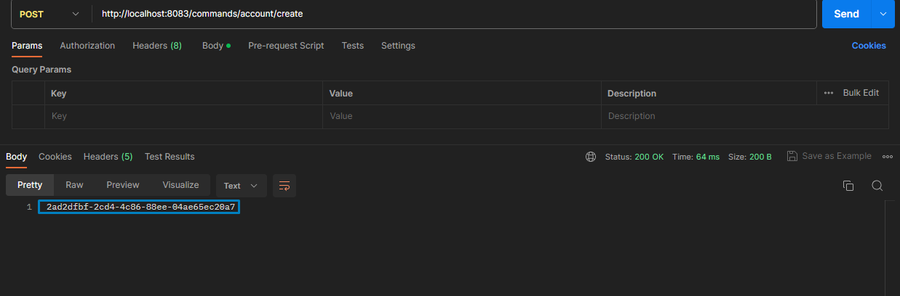

## Activité Pratique N°3 - Event Driven Architecture 📖🎓
La conception et la mise en œuvre d'une application Java reposant sur les principes du modèle CQRS (Command Query Responsibility Segregation) et de l'Event Sourcing, avec l'utilisation des frameworks Axon et Spring Boot.



### Objectifs de l'activité
L'objectif principal de cette activité est de familiariser avec les concepts de CQRS et Event Sourcing, ainsi qu'avec les outils puissants que sont Axon Framework et Spring Boot. À la fin de cette activité, on va développer une compréhension pratique de la manière dont ces modèles architecturaux peuvent être appliqués pour construire des systèmes robustes et évolutifs.

### Réalisation de l'activité
#### 1. Création du projet
Pour créer le projet, on va utiliser l'outil Spring Initializr. On va créer un projet Maven avec les dépendances suivantes :
- Spring Web
- Spring Data JPA
- Axon Framework
- Lombok
- Spring Boot DevTools
- Open API

#### 2. Architecture de l'application

#### 3. Commans and Events

##### Implémentation des commandes
###### **CommonApi**
CommonApi contient les classes de base pour les commandes et les événements. Il contient également les annotations nécessaires pour identifier les agrégats et les événements.
1. Commands 
* BaseCommand
Cette classe est la classe de base pour toutes les commandes. Elle contient l'identifiant de l'agrégat cible.
```java
public abstract class BaseCommand<T> {
    @TargetAggregateIdentifier
    @Getter
    private T id;

    public BaseCommand(T id) {
        this.id = id;
    }
}
```
@TargetAggregateIdentifier est une annotation qui identifie l'agrégat cible d'une commande. Elle est utilisée pour déterminer l'instance de l'agrégat à laquelle la commande doit être envoyée.
Remarque: Les commandes sont des objets immuables. Cela signifie que les champs de la commande ne peuvent pas être modifiés après sa création. C'est pourquoi nous utilisons Lombok pour générer automatiquement les constructeurs et les getters.

* CreateAccountCommand
```java
public class CreateAccountCommand extends BaseCommand<String> {
    @Getter
    private String currency;
    @Getter
    private double initialBalance;

    public CreateAccountCommand(String id, String currency, double initialBalance) {
        super(id);
        this.currency = currency;
        this.initialBalance = initialBalance;
    }
}
```

#### 3. Commands side

#### Création des commandes


